

  <a href="assets/banner.svg">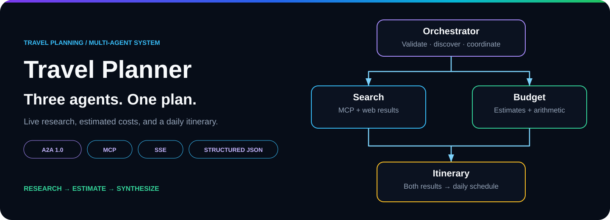</a>

<h1 align="center">Travel Planner · A2A</h1>

<strong>Three specialist agents. One coordinated travel plan.</strong>

Live destination research, calculated budgets, and day-by-day itineraries.

  
  
  
  
  

<table align="center">
  <tr>
    <td align="center"><a href="#overview"><b>🧭 Overview</b></a></td>
    <td align="center"><a href="#capabilities"><b>⚡ Features</b></a></td>
    <td align="center"><a href="#architecture"><b>🏗️ Architecture</b></a></td>
    <td align="center"><a href="#agents"><b>🤖 Agents</b></a></td>
  </tr>
  <tr>
    <td align="center"><a href="#workflow"><b>🔄 Workflow</b></a></td>
    <td align="center"><a href="#a2a"><b>🔗 A2A tasks</b></a></td>
    <td align="center"><a href="#mcp"><b>🔧 MCP search</b></a></td>
    <td align="center"><a href="#budget"><b>💵 Budget</b></a></td>
  </tr>
</table>

## 🧭 Overview

Travel Planner takes a destination, trip length, total group budget, and traveler count. The orchestrator discovers three independent HTTP agents, starts research and budget estimation together, and sends both completed results to the itinerary agent. The browser shows progress while the team works, then renders the complete plan.

> Research finds candidate places. Budget estimates the spend. Itinerary turns both results into a daily schedule.

<table>
  <tr>
    <td width="33%" valign="top"><strong>🔎 Research</strong>  Live web results supply attractions, hotels, and transport suggestions.</td>
    <td width="33%" valign="top"><strong>💵 Budget</strong>  The model estimates five spending categories. Application code calculates totals, per-person costs, and the verdict.</td>
    <td width="33%" valign="top"><strong>🗓️ Itinerary</strong>  Each requested day receives morning, afternoon, and evening activities, plus accommodation and practical travel tips.</td>
  </tr>
</table>

This is a planning application. Costs and recommendations are estimates; the app does not reserve travel or confirm availability.

## ⚡ Key capabilities

| Capability | What the app does |
| --- | --- |
| 📝 Trip brief | Accepts a destination, 1–21 days, a $100–$1,000,000 whole-group budget, and 1–12 travelers. |
| 🔎 Live research | Calls a SerpAPI-backed MCP tool and summarizes its results into structured findings. |
| ⚡ Parallel work | Runs search and budget concurrently after agent discovery. |
| 🔗 Agent discovery | Reads agent cards and selects their advertised A2A JSON-RPC endpoints. |
| 🗓️ Daily schedule | Produces three activity/location slots per day with expandable day sections. |
| 🏨 Stay and tips | Shows accommodation name and notes, transport advice, dining tips, and general travel tips. |
| 💵 Cost breakdown | Displays five categories, total, rounded per-person cost, notes, and budget verdict. |
| 📡 Live progress | Shows phases and each agent's Waiting, Working, Completed, or Failed status. |
| 📋 Protocol log | Displays timestamped discovery, phase, task, and result summaries with shortened task IDs. |
| ✅ Plan checks | Reports structural and arithmetic checks for the final plan. |
| 🧹 Clear and restart | Aborts the browser stream and clears results while retaining form values. |

## 🏗️ System architecture

<a href="assets/diagrams/system-architecture.svg">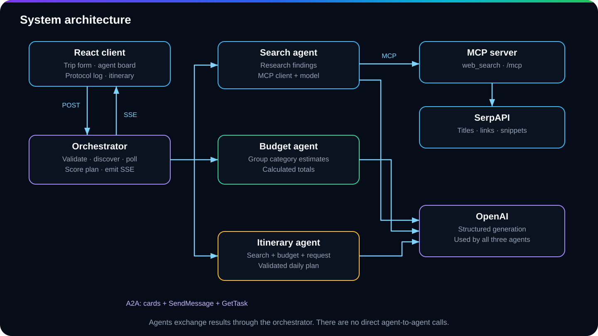</a>

Six processes run locally: the React client, orchestrator, three agents, and MCP server. The orchestrator is the only A2A client. It imports shared schemas and protocol helpers, but sends specialist work over HTTP.

| Boundary | Protocol | Purpose |
| --- | --- | --- |
| Browser → orchestrator | POST JSON; SSE response | Submit the trip and receive progress plus the final result. |
| Orchestrator → agents | A2A 1.0 over JSON-RPC 2.0 | Discover, submit, and poll tasks. |
| Search agent → tool server | MCP over Streamable HTTP | Invoke `web_search`. |
| Tool server → SerpAPI | HTTP | Retrieve up to five organic search results. |
| Each agent → OpenAI | Structured Responses API output | Produce schema-constrained research, estimates, or an itinerary draft. |

The browser never calls an agent directly. The agents do not message each other; the orchestrator passes completed results forward.

## 🤖 Specialist agents

| Agent | Receives | Performs | Returns |
| --- | --- | --- | --- |
| Search | Original trip request | Searches the destination, summarizes results, checks the destination name. | Summary, attractions, hotels, transport options. |
| Budget | Original trip request | Estimates category spending, then calculates final amounts in code. | Five categories, total, per-person cost, verdict, notes. |
| Itinerary | `{ request, search, budget }` | Drafts the schedule, validates days and slots, attaches the supplied budget. | Complete itinerary with accommodation and tips. |

The workflow is fixed in application code. There is no model-based supervisor choosing which agent to run. Every successful plan uses all three specialists, and each has its own HTTP server, agent card, executor, and task store.

## 🔄 How a request flows

<a href="assets/diagrams/multi-agent-workflow.svg">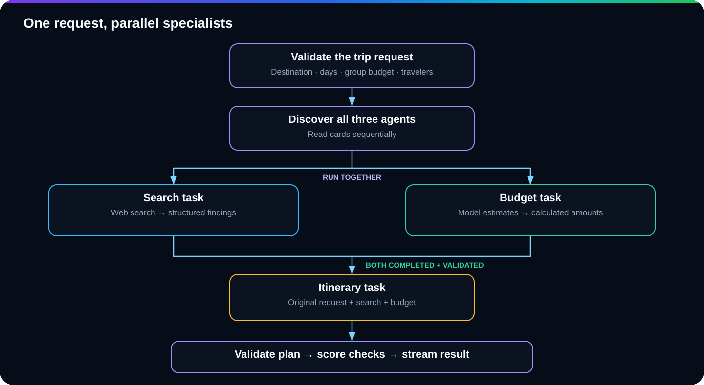</a>

1. **Submit.** The form sends `POST /api/plan/stream` with destination, days, budget, and travelers.
2. **Validate.** Invalid input returns HTTP 400. Valid input opens an SSE response.
3. **Discover.** The orchestrator reads search, budget, and itinerary cards sequentially.
4. **Run together.** Search and budget receive separate `SendMessage` requests. The orchestrator polls their task IDs.
5. **Join.** Both tasks must complete and their results must pass schema validation.
6. **Synthesize.** The itinerary agent receives the request and both validated results.
7. **Check.** The orchestrator validates the returned itinerary and calculates plan checks.
8. **Render.** A `result` event carries `{ plan, evaluation }`; `done` closes the successful workflow.

The [workflow guide](workflow.md) includes a sequence diagram, stream payloads, and failure paths.

## Screenshot walkthrough

One captured run follows a **5-day trip to Cairo for 2 travelers**, with a **$2,000 total budget**, from the initial form to the completed plan.

Follow the screenshots in order: [Setup](#1-enter-the-trip-details) · [Parallel work](#2-start-research-and-budget-together) · [Join](#3-wait-for-both-specialists) · [Result](#4-review-the-completed-plan) · [Budget](#5-scan-the-days-and-budget) · [Daily detail](#6-expand-the-daily-schedule) · [Checks](#7-review-travel-tips-and-plan-checks) · [Protocol](#8-trace-the-completed-run).

Screenshots retain their original PNG resolution and aspect ratio. Select any image to inspect it at full size.

### 1. Enter the trip details

Set the destination, number of days, total group budget, and traveler count. All three agents begin in **Waiting**.

  <a href="assets/screenshots/01-trip-setup.png">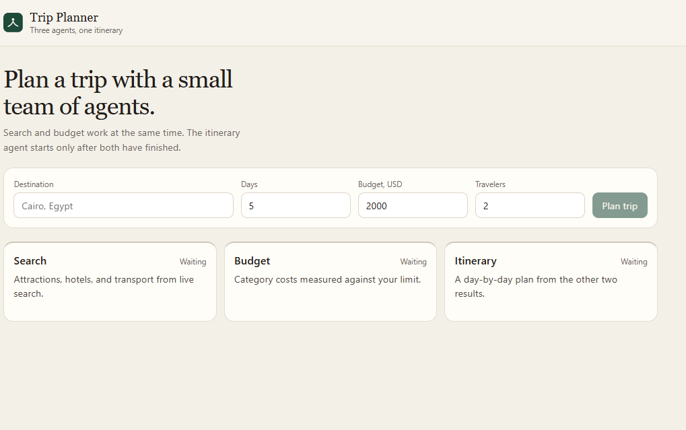</a>

*Figure 1. The trip brief before planning starts.*

### 2. Start research and budget together

After discovery, **Search** and **Budget** show **Working** at the same time. **Itinerary** remains **Waiting** while the protocol log records agent discovery and task submission.

  <a href="assets/screenshots/02-parallel-agents.png">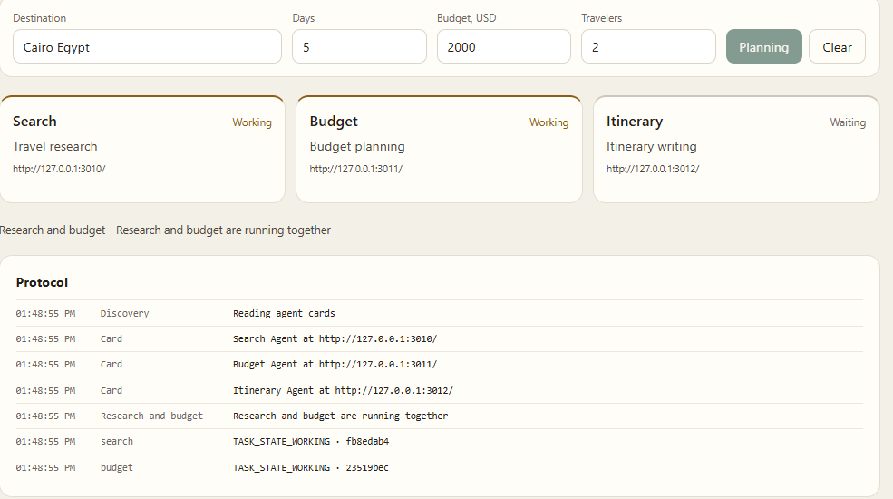</a>

*Figure 2. Two independent specialists run concurrently.*

### 3. Wait for both specialists

In this run, **Budget** finishes first. **Search** continues working, and **Itinerary** stays waiting: one completed prerequisite is not enough to start synthesis.

  <a href="assets/screenshots/03-budget-complete.png">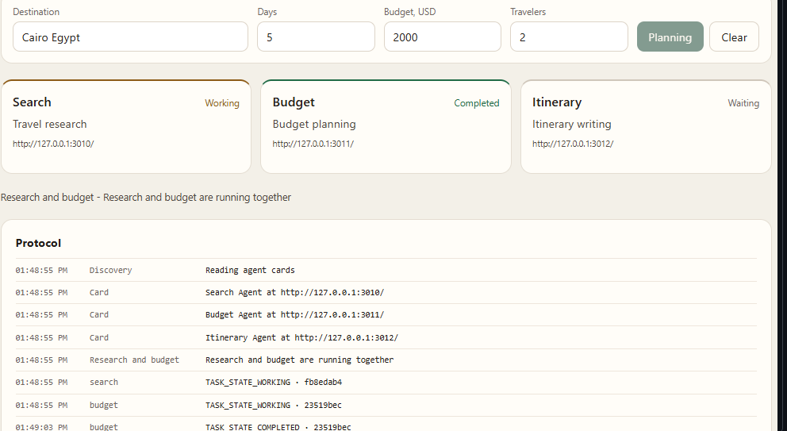</a>

*Figure 3. The workflow waits for the remaining research result.*

### 4. Review the completed plan

Once research and budget finish and their results pass validation, the itinerary agent combines them. The completed screen shows all three agents as **Completed**, followed by the trip summary and suggested accommodation.

  <a href="assets/screenshots/04-plan-ready.png">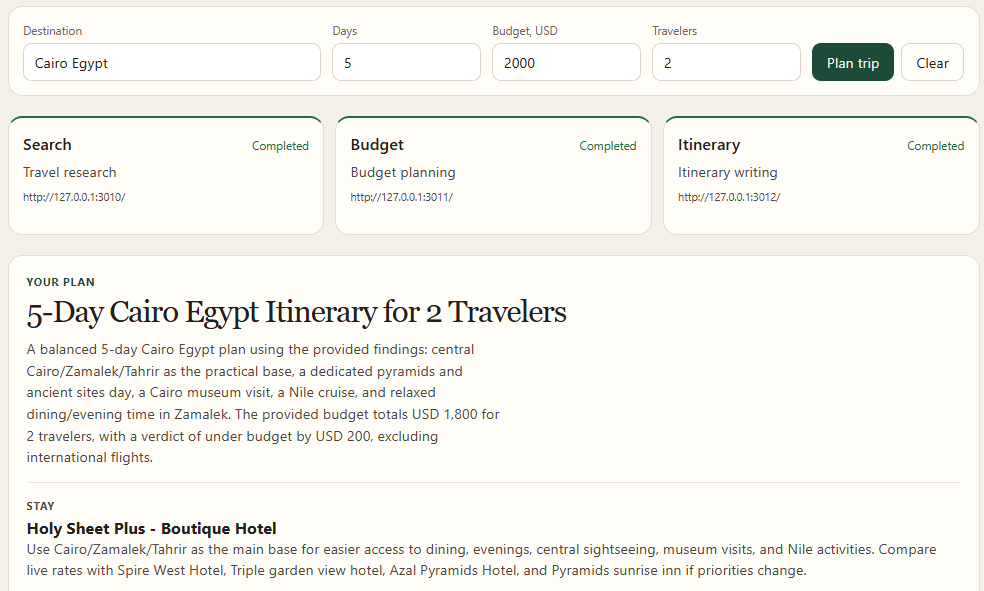</a>

*Figure 4. The generated plan appears below the completed agent board.*

### 5. Scan the days and budget

The collapsed day list provides an overview of the five-day schedule. This captured result estimates **$1,800 total**, **$900 per person**, and **$200 under budget**. Its five categories are $500 accommodation, $350 food, $300 transport, $450 activities, and $200 miscellaneous; the estimate excludes international flights.

  <a href="assets/screenshots/05-itinerary-budget.png">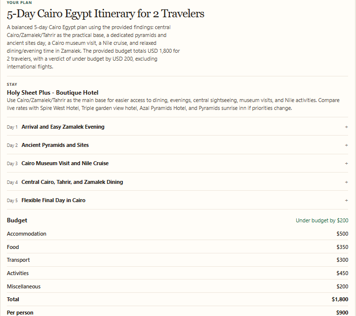</a>

*Figure 5. The schedule overview and whole-group cost breakdown.*

### 6. Expand the daily schedule

Open a day to inspect its **morning**, **afternoon**, and **evening** activities and locations. The screenshot shows the first three days expanded: arrival, ancient pyramids and sites, then a museum visit and Nile cruise.

  <a href="assets/screenshots/06-expanded-days.png">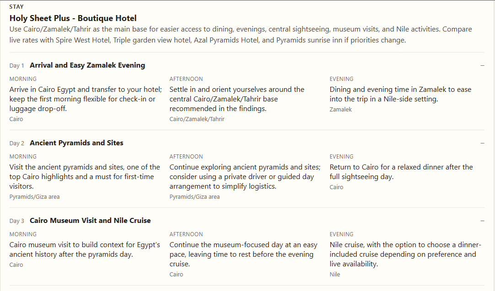</a>

*Figure 6. Daily details turn the overview into a practical schedule.*

### 7. Review travel tips and plan checks

The final plan includes transport, dining, and preparation advice. This run reports **10 of 10 plan checks passed**, covering structure, requested day count, activity slots, accommodation, budget arithmetic, and tips. These checks validate the plan's structure and consistency; they do not confirm live prices or availability.

  <a href="assets/screenshots/07-tips-plan-checks.png">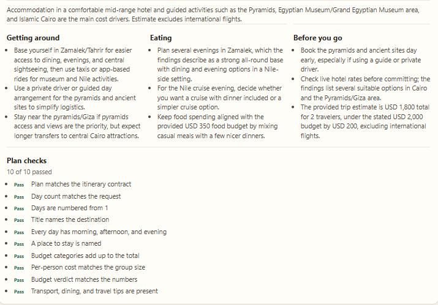</a>

*Figure 7. Practical advice and the final validation results.*

### 8. Trace the completed run

The protocol timeline confirms the order: budget completes, search completes, itinerary starts, then the final result arrives. Task identifiers connect each **Working** event to its **Completed** event.

  <a href="assets/screenshots/08-protocol-timeline.png">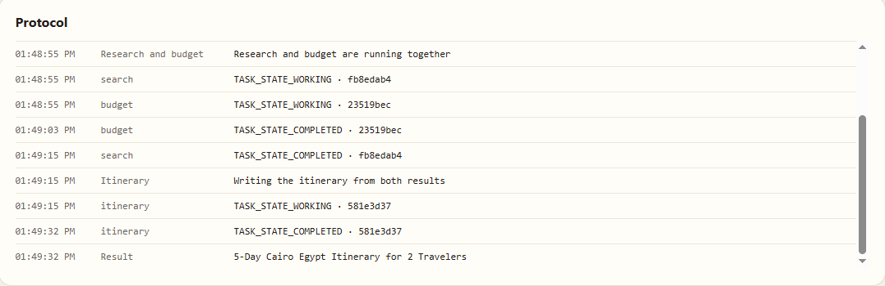</a>

*Figure 8. The recorded task lifecycle, including the join before itinerary generation.*

## 🔗 A2A task lifecycle

<a href="assets/diagrams/a2a-task-lifecycle.svg">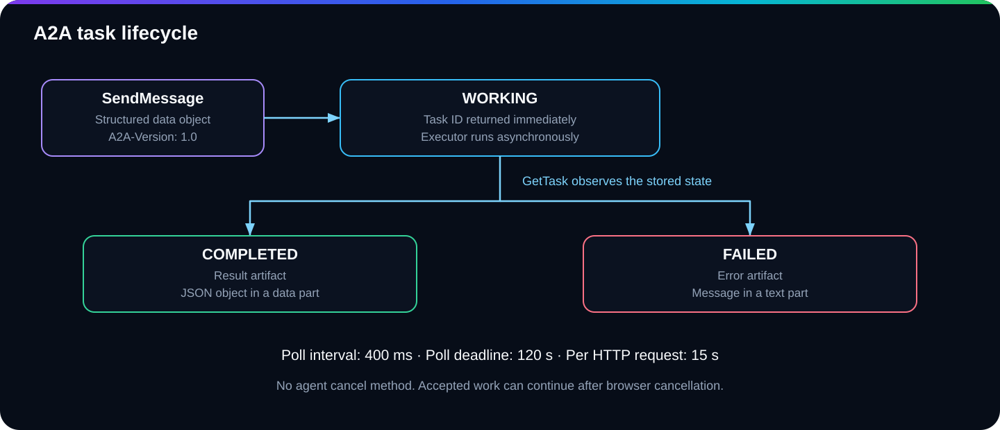</a>

An agent publishes `/.well-known/agent-card.json`, including its skill and supported interface. Task requests use the `A2A-Version: 1.0` header and JSON-RPC methods `SendMessage` and `GetTask`.

| State | Meaning |
| --- | --- |
| `TASK_STATE_WORKING` | Task accepted and stored; execution runs asynchronously. |
| `TASK_STATE_COMPLETED` | A result artifact contains structured JSON data. |
| `TASK_STATE_FAILED` | An error artifact contains explanatory text. |

The orchestrator polls at 400 ms intervals, with a 120-second deadline per polling loop and a 15-second deadline per HTTP request. These are separate limits. Agents advertise no A2A streaming or push notifications; browser SSE comes from the orchestrator.

Each agent holds up to 1,000 in-memory tasks. Finished tasks expire after 15 minutes, with cleanup on store access, and can be evicted sooner at capacity. Active tasks are retained; a store full of active tasks rejects new work. Agent restarts lose stored tasks.

## 🔧 MCP search integration

<a href="assets/diagrams/mcp-search-flow.svg">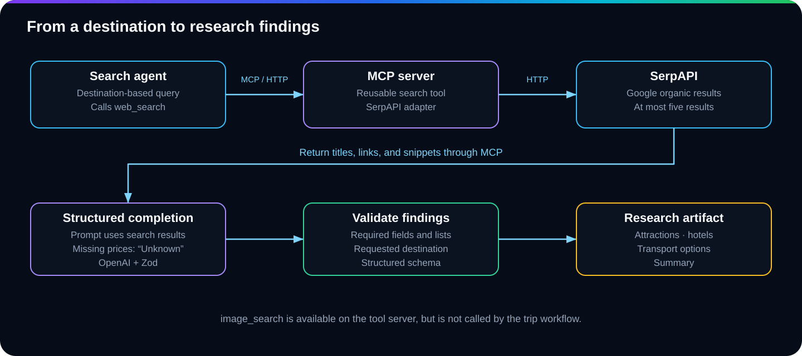</a>

The search agent creates one destination query ending in `top attractions recommended hotels flight options`. Its MCP client calls `web_search` at `/mcp`. The tool server returns up to five organic results containing titles, links, and snippets; the agent then asks the model to produce structured findings.

## 💵 Budget estimation and calculation

<a href="assets/diagrams/budget-calculation.svg">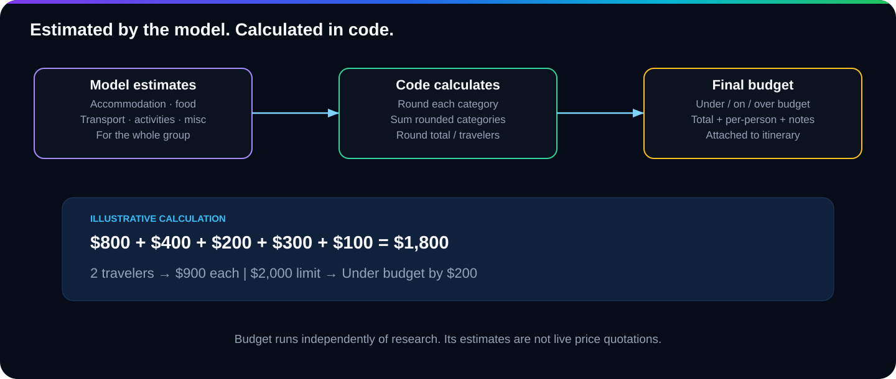</a>

Search and budget start together, so the budget agent does not consume search findings. It estimates the whole group's spending from the destination, days, travelers, and spending limit.

Application code rounds each category, sums those rounded values, calculates `Math.round(total / travelers)`, and compares the total with the requested budget. The itinerary assembler attaches that budget result instead of asking the itinerary model to recalculate it.

**Illustrative arithmetic:** $800 accommodation + $400 food + $200 transport + $300 activities + $100 miscellaneous = $1,800. For two travelers and a $2,000 limit, the result is $900 per person and `Under budget by $200`. These numbers explain the calculation; they are not a generated quote.
