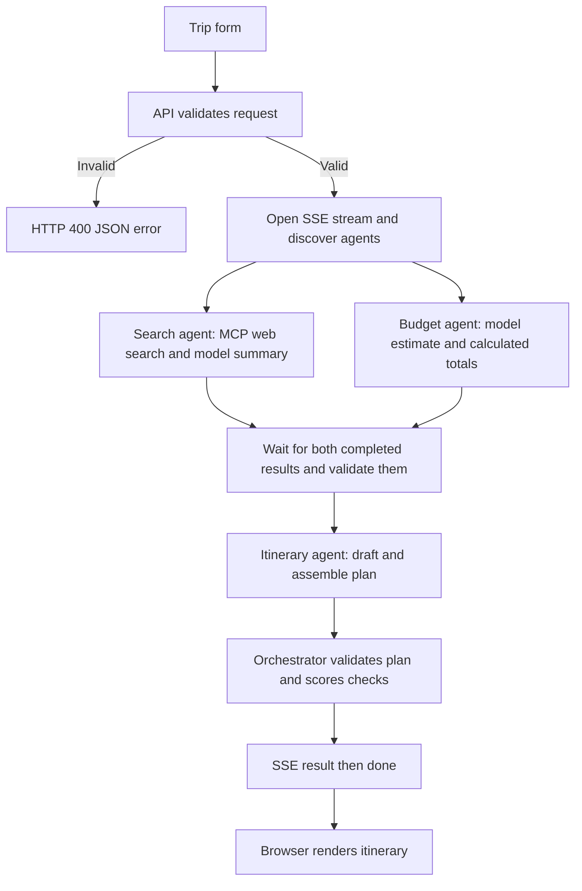
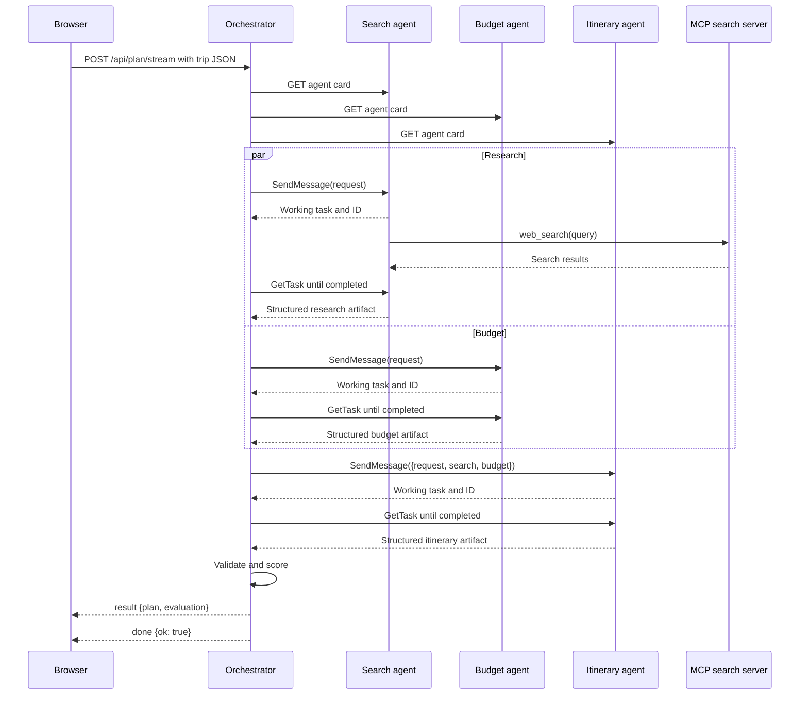

[← Documentation home](README.md)

# Workflow

## User journey

1. Open the client and enter a destination, days, total USD budget, and traveler count.
2. Select **Plan trip**. Previous output is cleared and form inputs are disabled.
3. Watch **Discovery** as the orchestrator reads the three agent cards.
4. Watch **Research and budget** while those two specialists run concurrently.
5. Watch **Itinerary** after both prerequisite results pass validation.
6. Review the itinerary, expand days, inspect the budget and tips, and read the plan checks.
7. Select **Clear** to remove the output and progress, or submit another request after planning ends.

## Execution flow

The implementation is in `server/services/orchestration/planTrip.js`. Agent discovery is sequential. Search and budget execution use `Promise.all`; itinerary generation starts only after both succeed.

Each specialist uses a structured model completion internally. The diagram abbreviates repeated polling; progress events reach the browser throughout execution.

## Browser stream events

The browser sends a POST using `fetch` and reads an SSE response. It does not open an A2A connection to any agent.

| Event | Payload | Effect |
| --- | --- | --- |
| `phase` | `phase`, `message` | Updates the phase indicator and log. Values are `discovery`, `parallel`, and `synthesis`. |
| `agent` | `name`, `card` | Adds discovered agent details to the board and log. |
| `task` | `name`, `state`, `taskId` | Updates task status and logs a shortened ID. |
| `result` | `plan`, `evaluation` | Renders the plan and checks, and clears the phase indicator. |
| `error` | `message` | Records an error that the stream reader surfaces to the page. |
| `done` | `ok` | Marks stream completion; success uses `true`, handled failure uses `false`. |

See `server/controllers/planController.js`, `client/src/services/planApi.js`, and `client/src/hooks/useTripPlanner.js`.

## Failure and cancellation paths

- Invalid input returns HTTP 400 before SSE starts.
- Discovery, tool, model, task, or result-validation errors stop the workflow. For a connected browser, the controller sends `error`, then `done` with `ok: false`.
- An agent returns `TASK_STATE_FAILED` with a text error artifact when its executor fails. The orchestrator turns that failure into a planning error.
- Each A2A HTTP request has a 15-second deadline. Each task polling loop has a 120-second deadline and waits 400 ms between unfinished polls.
- If either parallel specialist fails, remaining orchestration requests are aborted and itinerary generation is skipped.

The app does not implement a workflow-level retry or reconnection/resume mechanism. After addressing an error, submit a new request.
